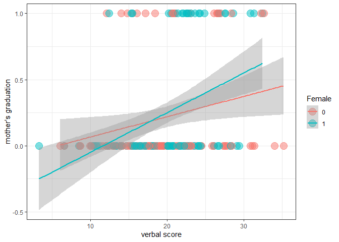

------------------------------------------------------------------------

title: “portfolio 5” author: “Yoo Ri Hwang” date: “4/26/2022” output:
github_document —

# Overview

In this portfolio, I aimed to be familair with regression, especially
when the DV is non-normal. Especially, this project will investigate
when the DV is binomail. (which menas that DV is just 0 or 1)

A conventional regression (OLS) assumes that DV is normally distributed.
However, if DV is not normally distributed, it violates this assumption.

Of Course, if the sample size is large enough, linear regression remains
sounds (source:
<https://iovs.arvojournals.org/article.aspx?articleid=2128171>)

## package

``` r
library(psych)
library(ggplot2)
```

    ## 
    ## Attaching package: 'ggplot2'

    ## The following objects are masked from 'package:psych':
    ## 
    ##     %+%, alpha

``` r
library(tidyverse)
```

    ## -- Attaching packages --------------------------------------- tidyverse 1.3.1 --

    ## v tibble  3.1.4     v dplyr   1.0.8
    ## v tidyr   1.2.0     v stringr 1.4.0
    ## v readr   2.0.1     v forcats 0.5.1
    ## v purrr   0.3.4

    ## Warning: package 'tidyr' was built under R version 4.1.3

    ## Warning: package 'dplyr' was built under R version 4.1.3

    ## -- Conflicts ------------------------------------------ tidyverse_conflicts() --
    ## x ggplot2::%+%()   masks psych::%+%()
    ## x ggplot2::alpha() masks psych::alpha()
    ## x dplyr::filter()  masks stats::filter()
    ## x dplyr::lag()     masks stats::lag()

## load the data

``` r
filepath <- "https://quantdev.ssri.psu.edu/sites/qdev/files/wisc3raw_gender.csv"
wisc3raw <- read.csv(file=url(filepath),header=TRUE)

## select the information that we need
wiscsub <- wisc3raw[ , c("id","verb1","verb2","verb4","verb6","momed","grad", "female")]

describe(wiscsub)
```

    ##        vars   n   mean    sd median trimmed   mad   min    max  range  skew
    ## id        1 204 102.50 59.03 102.50  102.50 75.61  1.00 204.00 203.00  0.00
    ## verb1     2 204  19.59  5.81  19.34   19.50  5.41  3.33  35.15  31.82  0.13
    ## verb2     3 204  25.42  6.11  25.98   25.40  6.57  5.95  39.85  33.90 -0.06
    ## verb4     4 204  32.61  7.32  32.82   32.42  7.18 12.60  52.84  40.24  0.23
    ## verb6     5 204  43.75 10.67  42.55   43.46 11.30 17.35  72.59  55.24  0.24
    ## momed     6 204  10.81  2.70  11.50   11.00  2.97  5.50  18.00  12.50 -0.36
    ## grad      7 204   0.23  0.42   0.00    0.16  0.00  0.00   1.00   1.00  1.30
    ## female    8 204   0.50  0.50   0.50    0.50  0.74  0.00   1.00   1.00  0.00
    ##        kurtosis   se
    ## id        -1.22 4.13
    ## verb1     -0.05 0.41
    ## verb2     -0.34 0.43
    ## verb4     -0.08 0.51
    ## verb6     -0.36 0.75
    ## momed      0.01 0.19
    ## grad      -0.30 0.03
    ## female    -2.01 0.04

If the outcome variable is binary, using the logistic link function
seems to be recomanded.

``` r
model1<-glm(grad~1 + verb1 + female + verb1*female, 
            famil='binomial',
            data=wiscsub,
            na.action=na.exclude)

summary(model1)
```

    ## 
    ## Call:
    ## glm(formula = grad ~ 1 + verb1 + female + verb1 * female, family = "binomial", 
    ##     data = wiscsub, na.action = na.exclude)
    ## 
    ## Deviance Residuals: 
    ##     Min       1Q   Median       3Q      Max  
    ## -1.4224  -0.6894  -0.5705  -0.2692   2.4419  
    ## 
    ## Coefficients:
    ##              Estimate Std. Error z value Pr(>|z|)    
    ## (Intercept)  -3.16798    0.92043  -3.442 0.000578 ***
    ## verb1         0.09119    0.04146   2.200 0.027835 *  
    ## female       -2.32308    1.56331  -1.486 0.137279    
    ## verb1:female  0.11490    0.06987   1.644 0.100080    
    ## ---
    ## Signif. codes:  0 '***' 0.001 '**' 0.01 '*' 0.05 '.' 0.1 ' ' 1
    ## 
    ## (Dispersion parameter for binomial family taken to be 1)
    ## 
    ##     Null deviance: 217.78  on 203  degrees of freedom
    ## Residual deviance: 194.79  on 200  degrees of freedom
    ## AIC: 202.79
    ## 
    ## Number of Fisher Scoring iterations: 5

``` r
coef(model1)
```

    ##  (Intercept)        verb1       female verb1:female 
    ##  -3.16797968   0.09119357  -2.32307801   0.11489670

``` r
exp(coef(model1))
```

    ##  (Intercept)        verb1       female verb1:female 
    ##   0.04208854   1.09548103   0.09797156   1.12175755

This binomial regression modelded the variable to log(odds) to Y to be
1. To interpret easily, I put exp() function to the coef.

one unit increase in verb1 score may increase the odds of DV by
1.09538103.

### plot

``` r
ggplot(data=wiscsub,
       aes(x=verb1, y=grad, color =factor(female)))+
  geom_point(alpha=0.5, size=5) +
  xlab("verbal score") + 
  ylab("mother's graduation")+
  guides(color=guide_legend(title="Female"))+
  theme_bw()+
  stat_smooth(method='glm',methodarges=list(family='binomial',se=TRUE, fullrange=TRUE))
```

    ## Warning: Ignoring unknown parameters: methodarges

    ## `geom_smooth()` using formula 'y ~ x'

<!-- -->

so far so good

## twist

This is the link functioin, the logit.

``` r
logit<-function(p){
  log(p/(1-p))
}
```
